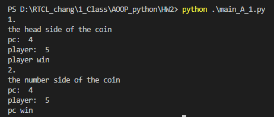
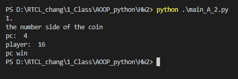
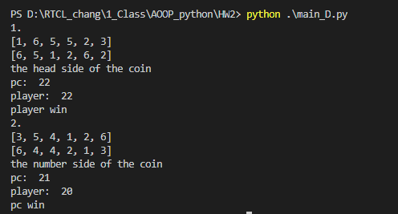

# HW1 Function

## Part1 : dice/coin 模擬賽局

1. 骰子模擬遊戲
    (A) 寫出一程式來模擬投擲骰子比大小遊戲,規則如下：
    ​    玩家及莊家各重複投擲一枚公正硬幣及兩顆骰子。
    ​    先投出硬幣決定比大或比小。正面比大，反面比小。
    ​    每一局用兩個骰子決定輸贏，共玩K次，直到玩家輸為止。

    - K＝myID*2+3, myID = studentNumber mod 3
    - 僅有一顆不公正的骰子，怪異點數 pt = myID + 1，prob = 0.15

    (A-1) 一枚公正硬幣(prob=0.5)，做k局用兩個骰子決定輸贏
    

    (A-2) 一枚不公正硬幣(prob=0.4)，做k局用三個骰子決定輸贏
    

    (D) 實作A_2情境並輸出骰子結果
    
2. function :
    (B) 寫出一投擲（公正/不公正通用的）硬幣func.
    ​    input: prob, from 0.45 to 0.55, smaller -> 0.45, bigger -> 0.55
    ​    output: 1-正面,2-反面
    (C) 寫出一投擲多個（公正/不公正通用的）骰子func.
    ​    input: N 個,pt(點數),prob(指定點數的理論機率) 
    ​    output: out_pts(各骰子的點數)
    ​    假設指定點數機率後，其他點數出現的機率均等
    ​    ex. [out_pts] = BiasNDices(N, pt, prob)

---

## Part1: Code
#### 1. Main: main_A_1.py
```python
# main_A_1.py
# 一枚公正硬幣(prob=0.5)，做k局用兩個骰子決定輸贏
import dice, coin, game

# data
myID = 15 % 3
k = myID *2 + 3

N = 2
pt = myID + 1
dice_prob = 0.15
coin_prob = 0.5

coin_num = coin.coin(coin_prob)

times = 0

# Who wins?
while times < k: 
    times += 1
    print(str(times) + ". ")
    pc = dice.multi_dice(N, pt, dice_prob, myID)
    player = dice.multi_dice(N, pt, dice_prob, myID)
    if game.show(pc,player,coin_num):
        break
   
```
#### 2. Main: main_A_2.py
```python
# main_A_2.py
# 一枚不公正硬幣(prob=0.4)，做k局用三個骰子決定輸贏
import dice, coin,game

# data
myID = 15 % 3
k = myID *2 + 3

N = 3
pt = myID + 1
dice_prob = 0.15
coin_prob = 0.4

coin_num = coin.coin(coin_prob)

times = 0

# Who wins?
while times < k: 
    times += 1
    print(str(times) + ". ")
    pc = dice.multi_dice(N, pt, dice_prob,myID)
    player = dice.multi_dice(N, pt, dice_prob,myID)
    if game.show(pc,player,coin_num):
        break
```

#### Main: main_D.py
```python
# main_D.py
# A_2: 一枚不公正硬幣(prob=0.4)，做k局用三個骰子決定輸贏
# 實作A_2情境並輸出骰子結果
import dice, coin, game

# data
myID = 15 % 3
k = 3

N = 3
pt = myID + 1
dice_prob = 0.15
coin_prob = 0.4

coin_num = coin.coin(coin_prob)

times = 0

# Who wins?
while times < k: 
    times += 1
    print(str(times) + ". ")
    pc = dice.sum(pt, dice_prob, k)
    player = dice.sum(pt, dice_prob, k)

    if game.show(pc,player,coin_num):
        break
```

#### Function : dice.py
```python
# dice.py

import random

def dice (pt, prob):
    random_prob = random.random()
    other_prob = float((1.0-prob)/5.0)
    number = [1, 2, 3, 4, 5, 6]

    if random_prob > 0 and random_prob <= prob:
        out_pt = pt
    else:
        number.remove(pt)
        if random_prob > prob and random_prob <= prob + other_prob:
            out_pt = number[0] 
        elif random_prob > (prob + other_prob) and random_prob <= prob + other_prob * 2:
            out_pt = number[1]
        elif random_prob > prob + other_prob*2 and random_prob <= prob + other_prob * 3:
            out_pt = number[2]
        elif random_prob > prob + other_prob*3 and random_prob <= prob + other_prob * 4:
            out_pt = number[3]
        elif random_prob > prob + other_prob*4 and random_prob <= prob + other_prob * 5:
            out_pt = number[4]

    return out_pt

def multi_dice(N,pt, prob,myID):
    sum = 0
    for x in range(N):
        if x == 1:
            sum += dice(myID+1,0.15)
        else:
            sum += dice(pt, 1/6)
    return sum

def one_dice(pt, prob , N):
    N_value = []
    sum = 0
    if prob < 0.1:
        prob = 0.1
    elif prob > 0.25:
        prob = 0.25
    else:
        prob = prob

    for i in range(N):
        N_value.append(dice(pt,prob)) 
    return N_value

def two_dice(pt, prob, k):
    dice1 = one_dice(pt,prob,k)
    dice2 = one_dice(2,1/6,k)
    dices = dice1 + dice2
    print(dices)
    return dices

def sum(pt, prob, k):
    sum = 0
    for i in two_dice(pt, prob, k):
        sum += i
    return sum
```
#### Function : coin.py
```python
# coin.py
import random
def coin(prob):
    temp = random.random()
    if prob < 0.45:
        prob = 0.45
    elif prob > 0.55:
        prob = 0.55
    else:
        prob = prob
    
    if temp <= prob:
        return 1
    else:
        return 2
```
#### Function : game.py
```python
# gmae.py
def show(pc,player,coin_num):
    if player >= pc and coin_num == 1:
        print("the head side of the coin")
        print("pc: ", pc)
        print("player: ", player)
        print("player win")
        return False
    elif player > pc and coin_num == 2:
        print("the number side of the coin")
        print("pc: ", pc)
        print("player: ", player)
        print("pc win")
        return True
    elif player < pc and coin_num == 1:
        print("the number side of the coin")
        print("pc: ", pc)
        print("player: ", player)
        print("pc win")
        return True
    elif player <= pc and coin_num == 2:
        print("the head side of the coin")
        print("pc: ", pc)
        print("player: ", player)
        print("player win")
        return False
    else:
        print("!!!!!")
        return True
```

## Part2 : Triangle Area
給三點計算三角型面積


```python
# triangle_area.py
import math

class Point():
    def __init__(self,x,y):
        self.x = x
        self.y = y

def getLength(p1,p2):
    length = math.sqrt((p1.x-p2.x)**2 + (p1.y-p2.y)**2)
    return length


def getArea(p1,p2,p3):
    p1_p2 = getLength(p1,p2)
    p2_p3 = getLength(p2,p3)
    p3_p1 = getLength(p3,p1)
    s = (p1_p2 + p2_p3 +p3_p1)/2
    area = math.sqrt(s*(s-p1_p2)*(s-p2_p3)*(s-p3_p1))
    return area


def main():
    points = []

    for i in range(3):
        x = float(input("x" + str(i+1) + ": "))
        y = float(input("y" + str(i+1) + ": "))
        points.append(Point(x,y))
    
    
    p1 = points[0]
    p2 = points[1]
    p3 = points[2]

    area = getArea(p1,p2,p3)
    print(area)

if __name__ == '__main__':
    main()

```

## Part3 :  freegames 

- snake.py

  - 貪吃蛇遊戲
  - snake遊戲是利用turtle、random及vector函式庫來進行繪圖
  - 利用random及vector隨機生成綠色小點的位置
  - 調用 `listen()`、`onkey()`來進行方向鍵之移動控制


- guess.py
  - 終極密碼
  - guess遊戲是利用`random`函式庫來產生亂數
  - `while loop`進行不斷猜測直到猜到答案


- flappy.py

  - 直升機遊戲
  - 利用`vector`、`turtle`函式庫進行繪圖
  - 以`random`函式庫隨機產生障礙物
  - 呼叫`onscreenclick()`來偵測滑鼠點擊，使紅點上升

  

---
## Part4 : * V.S. **

- 在Python中沒有指標。
- _*_ 是用來收集位置參數的。星號會將可變數量的潛在引數群組，變成一個參數值的tuple。
- _**_ 是用來收集關鍵字引數。他會將關鍵字引數變成一個字典。
---
